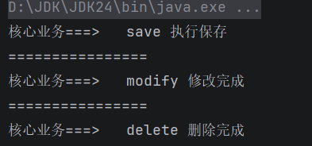
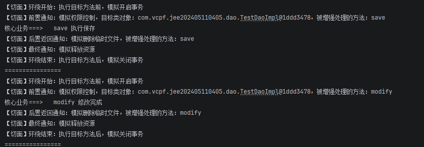

# 什么是AOP？

AOP，面向切面编程，是对OOP的补充。将大量重复的通用逻辑方法抽象出来，避免大量的繁琐操作。

AOP 是**横向**：把日志、事务、权限校验、性能统计这些**通用功能抽象出来**，在不修改原有代码的前提下，自动加到方法前后 / 异常时执行。

切面是对业务本身的增加，需要时切入，不需要时，用注解配置的方式拔除

- 业务链本身是纵向的
- 而切面则是横向的，在某个时机执行即可


## 切面编程的目的

* 解耦和规范化项目构建和实现【解耦动作】
* 让业务动作本身更单纯，注意力更专注【解放业务】
* 让公共动作更统一【统一、规范、专业、全面】
* 让公共动作更规范


## AOP依赖

``` xml
<dependency>
  <groupId>org.springframework.boot</groupId>
  <artifactId>spring-boot-starter-aop</artifactId>
</dependency>
```

---


# 面向切面编程

理解面向切面编程
- 以后将一些有前后关系的动作，用切面的方式来管理
- 这些动作多了，就抽出来做成公共的动作
- 横向切出来的面，即切面
- 整个业务链是纵向的，但需要有一些动作是公共的，有一些是该业务本核心部分


## 切面的类型

* 之前
* 返回之后
* 环绕【有前有后】
* 异常之后
* 之后


# 模拟AOP

## 创建核心业务接口

```java
public interface TestDao {
    void save();
    void modify();
    void delete();
}
```


## 实现核心业务接口

```java
@Repository
public class TestDaoImpl implements TestDao {
    @Override
    public void save() {
        System.out.println("核心业务===>   save 执行保存");
    }

    @Override
    public void modify() {
        System.out.println("核心业务===>   modify 修改完成");
    }

    @Override
    public void delete() {
        System.out.println("核心业务===>   delete 删除完成");
    }
}
```


## 添加切面

- 创建一个类，MyAspect

- 注解为切面，也就是每个核心业务均要在之前之后完成的系统动作

  - 身份验证，权限认证

  - 资源准备

  - 日志记录

  - 资源回收

- 注解为容器的组件，也就是将它也交给IOC容器管理，也就是Spring容器
- 定义切点
  - 定义各种连接点：之前，之后，环线，正常返回，异常抛出

``` java
package com.vcpf.jee202405110405;

import org.aspectj.lang.JoinPoint;
import org.aspectj.lang.ProceedingJoinPoint;
import org.aspectj.lang.annotation.*;
import org.springframework.stereotype.Component;

@Aspect // 声明一个切面，注释本行，即拔掉切面，添加本行，即切入切面
@Component // 让此切面成为Spring容器管理的Bean
public class MyAspect {
    // 定义切入点，通知增强哪些方法。
    //  @Pointcut("execution(* com.vcpf.jee202405110405.dao.*.*(..))")
    // 告诉IoC在那部分中使用
    /*"execution(* aspectj.dao.*.*(..))" 是定义切入点表达式，
        该切入点表达式的意思是匹配aspectj.dao包中任意类的任意方法的执行。
        其中execution()是表达式的主体，第一个*表示的是返回类型，使用*代表所有类型；
        aspectj.dao表示的是需要匹配的包名，后面第二个*表示的是类名，使用*代表匹配包中所有的类；
        第三个*表示的是方法名，使用*表示所有方法； 后面(..)表示方法的参数，其中“..”表示任意参数。
        另外，注意第一个*与包名之间有一个空格。*/
    
    @Pointcut("execution(* com.vcpf.jee202405110405.dao.*.*(..))")
    private void myPointCut(){}

    // 前置通知，使用Joinpoint接口作为参数获得目标对象信息
    @Before("myPointCut()")
    public void before(JoinPoint jp){
        System.out.print("【切面】前置通知：模拟权限控制");
        System.out.println("，目标类对象：" + jp.getTarget()
                + "，被增强处理的方法：" + jp.getSignature().getName());
    }

    // 后置返回通知
    @AfterReturning("myPointCut()")
    public void afterReturning(JoinPoint jp) {
        System.out.print("【切面】后置返回通知：" + "模拟删除临时文件");
        System.out.println("，被增强处理的方法：" + jp.getSignature().getName());
    }

     /**
     * 环绕通知
     * ProceedingJoinPoint是JoinPoint子接口，代表可以执行的目标方法
     * 返回值类型必须是Object
     * 必须一个参数是ProceedingJoinPoint类型
     * 必须throws Throwable
     */
    @Around("myPointCut()")
    public Object around(ProceedingJoinPoint pjp) throws Throwable{
        //开始
        System.out.println("【切面】环绕开始：执行目标方法前，模拟开启事务");
        //执行当前目标方法
        Object obj = pjp.proceed();
        //结束
        System.out.println("【切面】环绕结束：执行目标方法后，模拟关闭事务");
        return obj;
    }

    // 异常通知
    @AfterThrowing(value="myPointCut()",throwing="e")
    public void except(Throwable e) {
        System.out.println("【切面】异常通知：" + "程序执行异常" + e.getMessage());
    }

    // 结束时通知
    @After("myPointCut()")
    public void after() {
        System.out.println("【切面】最终通知：模拟释放资源");
    }
}

```

> - 注意切面方法的入口对象
> - 注意切面方法的入口对象的方法
> - 要特别注意切点表达式字符串的写法


## 切面方法的入参和返回值

- 前置通知，返回通知 均不需要返回值

- 前置通知，返回通知的入参可以是 JoinPoint，即连接点指定，通过连接点对象，可以拿到目标类对象的一些信息

- 环绕通知，必须 返回 Object 对象，即它可以返回一切 【三个必须】

  - 【1 必须】 有一个 ProceedingJoinPoint 即处理中的连接点

  - 【2 必须 】 因为前后都做增强，所以 ` 之前、之后 `也就是 ` 环绕 ` 做完后，还一定要返回一个对象

  - 【3 必须】方法本身会往上抛出一个 `Throwable` 异常

- 异常通知，没有返回，但必须 有一个能拿到异常信息的 Throwable 参数
- 最终通知，没有返回，也没有入参

- 它只做善后处理


# 切面配置

- 开启Spring容器对AOP框架AspectJ的支持
- 后面容器按这个配置来获取相应的组件对象---IOC容器

``` java
@Configuration
@ComponentScan("com.vcpf.jee202405110405")
@EnableAspectJAutoProxy
public class AspectjAopConfig {
}
```


# 测试

## 未使用AOP

```java
package com.vcpf.jee202405110405.test;

import com.vcpf.jee202405110405.dao.TestDao;
import com.vcpf.jee202405110405.dao.TestDaoImpl;

public class AOPTestOld {
    public static void main(String[] args) {
        TestDao testDao = new TestDaoImpl();
        //执行方法
        testDao.save();
        System.out.println("================");
        testDao.modify();
        System.out.println("================");
        testDao.delete();

    }
}
```



## 测试切面的织入运行

```java
package com.vcpf.jee202405110405.test;

import com.vcpf.jee202405110405.config.AspectjAopConfig;
import com.vcpf.jee202405110405.dao.TestDao;
import org.springframework.context.annotation.AnnotationConfigApplicationContext;

public class AOPTest {
    public static void main(String[] args) {
       // 拿到容器：初始化Spring容器ApplicationContext
       AnnotationConfigApplicationContext appCon =
          new AnnotationConfigApplicationContext(AspectjAopConfig.class);
       // 拿到组件：从容器中，获取增强后的目标对象
       TestDao testDaoAdvice = appCon.getBean(TestDao.class);
       // 使用组件：做业务，执行方法
       testDaoAdvice.save();
       System.out.println("================");
       testDaoAdvice.modify();
       System.out.println("================");
       testDaoAdvice.delete();

        // 关闭容器
       appCon.close();
    }
}
```



## 主动制作异常测试

``` java
public void delete() { 
    try {
        int i=1/0;
    } catch (Exception e) {
        throw new RuntimeException(e);
    } finally {

    }
    System.out.println("核心业务===>   delete 删除完成");
}
```

