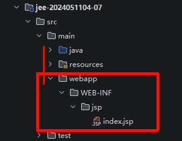
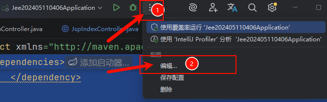
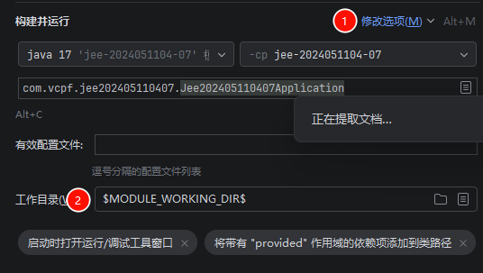
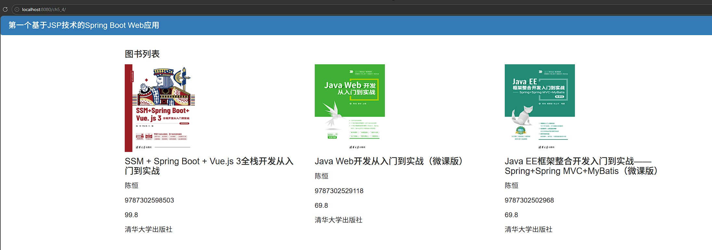

# JSP返回视图

`@Controller`和`@RestController`是我们主要的控制其返回类型，前者返回的是视图，后者返回的是数据。本节的JSP就是通过后端构建视图并通过`@Controller`返回。


## JSP依赖

``` xml
<properties>
        <java.version>17</java.version>
        <project.build.sourceEncoding>UTF-8</project.build.sourceEncoding>
        <project.reporting.outputEncoding>UTF-8</project.reporting.outputEncoding>
        <spring-boot.version>2.6.13</spring-boot.version>
    </properties>
    <dependencies>
        <dependency>
            <groupId>org.springframework.boot</groupId>
            <artifactId>spring-boot-starter-web</artifactId>
        </dependency>

        <!-- JSP解析引擎（内嵌Tomcat必须） -->
        <dependency>
            <groupId>org.apache.tomcat.embed</groupId>
            <artifactId>tomcat-embed-jasper</artifactId>
        </dependency>

        <!-- 【核心修复】兼容Spring Boot 2.x的JSTL标签库（javax规范） -->
        <dependency>
            <groupId>javax.servlet</groupId>
            <artifactId>jstl</artifactId>
            <version>1.2</version>
        </dependency>

        <!-- 测试依赖 -->
        <dependency>
            <groupId>org.springframework.boot</groupId>
            <artifactId>spring-boot-starter-test</artifactId>
            <scope>test</scope>
        </dependency>
        <dependency>
            <groupId>org.projectlombok</groupId>
            <artifactId>lombok</artifactId>
            <optional>true</optional>
            <version>1.18.42</version>
        </dependency>
    </dependencies>
```


## JSP项目

### 创建webapp

这个目录是存放要返回的前端主界面的路径，此路径下存放`index.jsp`。注意存放路径在根目录下：




### 配置JSP

创建完成之后修改IDEA下的working dir目录 为：`$MODULE_WORKING_DIR$`





### 添加配置行

添加配置行，做视图配置

```  properties
server.servlet.context-path=/ch5_4
#设置页面前缀目录
spring.mvc.view.prefix=/WEB-INF/jsp/
#设置页面后缀
spring.mvc.view.suffix=.jsp
```


## 后端

### 实体

```java
package com.vcpf.jee202405110407.entity;

import lombok.AllArgsConstructor;
import lombok.Data;
import lombok.NoArgsConstructor;
import lombok.experimental.Accessors;

@Data
@AllArgsConstructor
@NoArgsConstructor
@Accessors(chain = true)
public class Book {
    String isbn;
    Double price;
    String bname;
    String publishing;
    String author;
    String picture;
}
```


## 控制器

```java
package com.vcpf.jee202405110407.controller;

import org.springframework.stereotype.Controller;
import org.springframework.ui.Model;
import org.springframework.web.bind.annotation.GetMapping;
import com.vcpf.jee202405110407.entity.Book;
import org.springframework.web.bind.annotation.RestController;

import java.util.ArrayList;
import java.util.List;

/**
 * 控制器
 * <pre>
 *     1. 接请求
 *     2. 封装数据
 *     3. 导航到页面
 * </pre>
 */
@Controller
public class JspIndexController {

    @GetMapping("/")
    public String index(Model model) {
        List<Book> chenHeng = new ArrayList<Book>();
        Book teacherGeng = new Book(
                "9787302598503",99.8,
                "SSM + Spring Boot + Vue.js 3全栈开发从入门到实战",
                "清华大学出版社","陈恒","091883-01.jpg"
        );
        Book b1 = new Book(
                "9787302529118", 69.8,
                "Java Web开发从入门到实战（微课版）",
                "清华大学出版社", "陈恒","082526-01.jpg"
        );
        Book b2 = new Book(
                "9787302502968", 69.8,
                "Java EE框架整合开发入门到实战——Spring+Spring MVC+MyBatis（微课版）",
                "清华大学出版社", "陈恒","079720-01.jpg");
        chenHeng.add(b1);
        chenHeng.add(b2);
        // 单本
        model.addAttribute("aBook", teacherGeng);
        // 多本，列表
        model.addAttribute("books", chenHeng);
        return "index";
    }
}
```


## 前端视图

``` html
<%@ page language="java" contentType="text/html; charset=UTF-8" pageEncoding="UTF-8"%>
<!-- 引入JSTL标签 -->
<%@ taglib prefix="c" uri="http://java.sun.com/jsp/jstl/core" %>
<%
    String path = request.getContextPath();
    String basePath = request.getScheme() + "://" + request.getServerName() + ":" + request.getServerPort() + path + "/";
%>
<!DOCTYPE html>
<html>
<head>
    <base href="<%=basePath%>">
    <meta charset="UTF-8">
    <title>JSP测试</title>
    <link href="css/bootstrap.min.css" rel="stylesheet">
</head>
<body>
<div class="panel panel-primary">
    <div class="panel-heading">
        <h3 class="panel-title">第一个基于JSP技术的Spring Boot Web应用</h3>
    </div>
</div>
<div class="container">
    <div>
        <h4>图书列表</h4>
    </div>
    <div class="row">
        <div class="col-md-4 col-sm-6">
            <!-- 使用EL表达式 -->
            <a href="">
                
            </a>
            <div class="caption">
                <h4>${aBook.bname}</h4>
                <p>${aBook.author}</p>
                <p>${aBook.isbn}</p>
                <p>${aBook.price}</p>
                <p>${aBook.publishing}</p>
            </div>
        </div>
        <!-- 使用JSTL标签forEach循环取出集合数据 -->
        <c:forEach var="book" items="${books}">
            <div class="col-md-4 col-sm-6">
                <a href="">
                    
                </a>
                <div class="caption">
                    <h4>${book.bname}</h4>
                    <p>${book.author}</p>
                    <p>${book.isbn}</p>
                    <p>${book.price}</p>
                    <p>${book.publishing}</p>
                </div>
            </div>
        </c:forEach>
    </div>
</div>
</body>
</html>

```

将其他资源放到静态资源static下后，就可以测试了


# 测试结果

