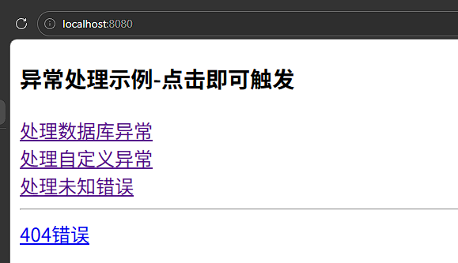
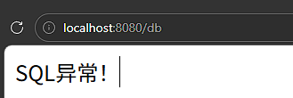
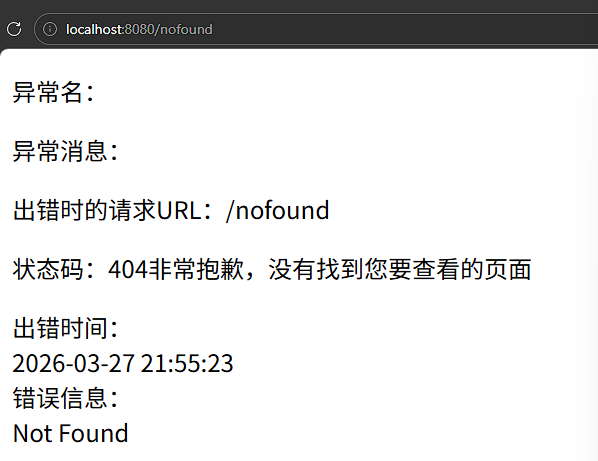

# 统一的异常页面处理

## 项目依赖

* web
* test
* thymeleaf

``` xml
<dependency>
    <groupId>org.springframework.boot</groupId>
    <artifactId>spring-boot-starter-web</artifactId>
</dependency>
<dependency>
    <groupId>org.springframework.boot</groupId>
    <artifactId>spring-boot-starter-test</artifactId>
    <scope>test</scope>
</dependency>
<dependency>
    <groupId>org.springframework.boot</groupId>
    <artifactId>spring-boot-starter-thymeleaf</artifactId>
</dependency>
```


## 项目代码

### index 主页



``` html
<!DOCTYPE html>
<html xmlns:th="http://www.thymeleaf.org">
<head>
    <meta charset="UTF-8">
    <title>主页，用链接触发异常</title>
    <link rel="stylesheet" th:href="@{css/bootstrap.min.css}" />
</head>
<body>
<div class="panel panel-primary">
    <div class="panel-heading">
        <h3 class="panel-title">异常处理示例-点击即可触发</h3>
    </div>
</div>
<div class="container">
    <div class="row">
        <div class="col-md-4 col-sm-6">
            <a th:href="@{db}">处理数据库异常</a><br>
            <a th:href="@{my}">处理自定义异常</a><br>
            <a th:href="@{no}">处理未知错误</a>
            <hr>
            <a th:href="@{nofound}">404错误</a>
        </div>
    </div>
</div>
</body>
</html>

```

> [!CAUTION]
>
> 使用`thymeleaf`依赖，需要将所有的H5文件放到`resources/templates`目录下才能正常访问。


### 控制器

```java
package com.vcpf.jee202405110406.Controller;

import com.vcpf.jee202405110406.exception.MyException;
import org.springframework.stereotype.Controller;
import org.springframework.web.bind.annotation.ExceptionHandler;
import org.springframework.web.bind.annotation.GetMapping;

import java.sql.SQLException;

@Controller
public class TestHandleExceptionController {

    // http://localhost:8080/
    @GetMapping("/")
    public String index() {
        return "index";
    }
}
```


## 自定义通用错误页面

- 这个页面，默认名字就是 error.html

- SB 的项目，将自动找到该页，作用错误处理页

- 自动可以找到以下属性

  - timestamp	时间戳

  - status		HTTP 状态码

  - error		错误原因【调试用】

  - exception	异常类名

  - message		异常消息【调试用】
  - errors		各种错误，由异常引起的

  - trace		异常跟踪信息

  - path			错误发生时的 URL 路径

```html
<!DOCTYPE html>
<html xmlns:th="http://www.thymeleaf.org">
<head>
    <meta charset="UTF-8">
    <title>error-出错显示页</title>
    <link rel="stylesheet" th:href="@{css/bootstrap.min.css}" />
</head>
<body>
<div class="panel-l container clearfix">
    <div class="error">
        <p class="title">
            异常名：<span class="code" th:text="${exception}"></span>
        </p>
        <p class="title">
            异常消息：<span class="code" th:text="${message}"></span>
        </p>
        <p class="title">
            出错时的请求URL：<span class="code" th:text="${path}"></span>
        </p>
        <p class="title">
            状态码：<span class="code" th:text="${status}"></span>非常抱歉，没有找到您要查看的页面
        </p>
        <div class="common-hint-word">
            出错时间：<div th:text="${#dates.format(timestamp,'yyyy-MM-dd HH:mm:ss')}"></div>
            错误信息：<div th:text="${error}"></div>
        </div>
    </div>
</div>
</body>
</html>
```


### 具体的自定义错误

- 可以自定义更友好的页面，来告诉用户出错了
- 用切面方面，统一管理异常或出错
- 只有走过控制器的异常，才会这样

#### 自定义异常

```java
public class MyException extends Exception {
    private static final long serialVersionUID = 1L;
    public MyException() {
        super();
    }
    public MyException(String message) {
        super(message);
    }
}
```


####  在控制器中添加异常处理器方法

```java
@Controller
public class TestHandleExceptionController {

    // http://localhost:8080/
    @GetMapping("/")
    public String index() {
        return "index";
    }

    // 用注解方式，做异常处理器
    // 一旦捕获异常，则返回视图，做导航用
    @ExceptionHandler(value=Exception.class)
    public String handlerException(Exception e) {
        //数据库异常
        if (e instanceof SQLException) {
            return "sqlError";
        //自定义异常
        } else if (e instanceof MyException) {
            return "myError";
        //未知异常
        } else {
            return "noError";
        }
    }
}
```


#### 添加控制器导航

```java
package com.vcpf.jee202405110406.Controller;

import com.vcpf.jee202405110406.exception.MyException;
import org.springframework.stereotype.Controller;
import org.springframework.web.bind.annotation.ExceptionHandler;
import org.springframework.web.bind.annotation.GetMapping;

import java.sql.SQLException;

@Controller
public class TestHandleExceptionController {

    // http://localhost:8080/ch5_3
    @GetMapping("/")
    public String index() {
        return "index";
    }

    // 用注解方式，做异常处理器
    // 一旦捕获异常，则返回视图，做导航用
    @ExceptionHandler(value=Exception.class)
    public String handlerException(Exception e) {
        //数据库异常
        if (e instanceof SQLException) {
            return "sqlError";
            //自定义异常
        } else if (e instanceof MyException) {
            return "myError";
            //未知异常
        } else {
            return "noError";
        }
    }
    @GetMapping("/db")
    public void db() throws SQLException {
        throw new SQLException("数据库异常");
    }
    @GetMapping("/my")
    public void my() throws MyException {
        throw new MyException("自定义异常");
    }
    @GetMapping("/no")
    public void no() throws Exception {
        throw new Exception("未知异常");
    }
}
```


### 创建处理出错页面

```html
<!DOCTYPE html>
<html lang="en">
<head>
    <meta charset="UTF-8">
    <title>自定义-数据库异常页</title>
</head>
<body>
  SQL异常！
</body>
</html>
```

``` html
<!DOCTYPE html>
<html lang="en">
<head>
    <meta charset="UTF-8">
    <title>自定义-自定义异常页</title>
</head>
<body>
  自定义异常！
</body>
</html>
```

``` html
<!DOCTYPE html>
<html lang="en">
<head>
    <meta charset="UTF-8">
    <title>自定义-未知异常页</title>
</head>
<body>
  未知异常！
</body>
</html>
```




