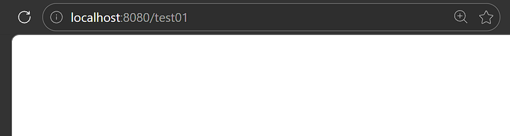
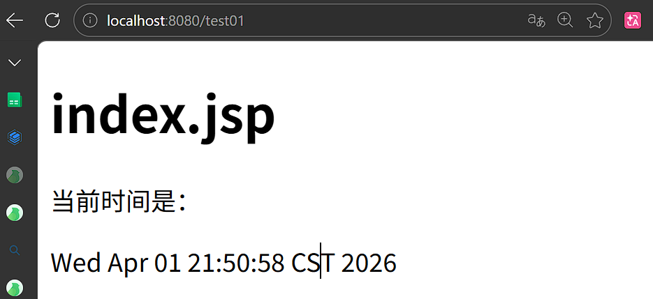

# 拦截器

在某些场景下，如登录等操作。在未进行登陆之前，不允许器访问一些资源，所以我们需要一个程序来判断是否允许访问这些受限制的资源。Spring为我们提供了这一接口实现这一功能：`HandlerInterceptor接口`，通过这一接口，实现自定义拦截器的功能。

HandlerInterceptor接口定义了三中方法，分别是：`preHandle`，`postHandle`，`afterCompletion`。通过重写这三中方法实现请求前、请求后等操作

# 拦截器的实现

## 项目依赖

```xml
<dependency>
    <groupId>org.springframework.boot</groupId>
    <artifactId>spring-boot-starter-web</artifactId>
</dependency>
<dependency>
    <groupId>org.apache.tomcat.embed</groupId>
    <artifactId>tomcat-embed-jasper</artifactId>
</dependency>
<dependency>
    <groupId>jstl</groupId>
    <artifactId>jstl</artifactId>
    <version>1.2</version>
</dependency>
<dependency>
    <groupId>org.springframework.boot</groupId>
    <artifactId>spring-boot-devtools</artifactId>
    <scope>runtime</scope>
    <optional>true</optional>
</dependency>
<dependency>
    <groupId>org.projectlombok</groupId>
    <artifactId>lombok</artifactId>
    <optional>true</optional>
</dependency>
<dependency>
    <groupId>org.springframework.boot</groupId>
    <artifactId>spring-boot-starter-test</artifactId>
    <scope>test</scope>
</dependency>
```

## jsp

### jsp配置

```properties
spring.mvc.view.suffix=.jsp
spring.mvc.view.prefix=/
```

### index.jsp

```jsp
<%@ page contentType="text/html; utf-8" pageEncoding="utf-8" %>
<%@ page import="java.util.Date" %>
<!doctype html>
<html lang="en">
<head>
    <meta charset="UTF-8">
    <meta name="viewport"
          content="width=device-width, user-scalable=no, initial-scale=1.0, maximum-scale=1.0, minimum-scale=1.0">
    <meta http-equiv="X-UA-Compatible" content="ie=edge">
    <title>index.jsp</title>
</head>
<body>
<h1>index.jsp</h1>
当前时间是：<p><%=new Date()%></p>
</body>
</html>
```


## 拦截器模版写法

```java
@Configuration
public class WebMvcConfig  implements WebMvcConfigurer {
    @Override
    public void addInterceptors(InterceptorRegistry registry) {
        registry.addInterceptor("拦截器")
        .addPathPatterns("拦截路径")
        .excludePathPatterns("排除路径")
        .order("指定执行顺序");
    }
}
```


## 拦截器的实现

### 控制器

```java
@Controller
public class TestController {

    @RequestMapping("test01")
    public String test01() {
        return "test01";
    }
}
```

### 拦截器

```java
@Component
public class MyInterceptor implements HandlerInterceptor {

    @Override
    public boolean preHandle(HttpServletRequest request,
                             HttpServletResponse response,
                             Object handler) throws Exception {
        System.out.println("MyInterceptor.preHandle===在请求发生前进行拦截器方法执行。。。。");
        // 返回假：拦截，不放行
        return false;
        // 返回真：不拦截，放行
//        return true;
    }

    @Override
    public void postHandle(HttpServletRequest request,
                           HttpServletResponse response,
                           Object handler,
                           ModelAndView modelAndView) throws Exception {
        System.out.println("MyInterceptor.postHandle===在请求完成后进行拦截器方法执行。。。。");
    }

    @Override
    public void afterCompletion(HttpServletRequest request,
                                HttpServletResponse response,
                                Object handler,
                                Exception ex) throws Exception {

    }
}

```

### 拦截器的配置类

``` java
@Configuration
public class WebMvcConfig  implements WebMvcConfigurer {

    private final MyInterceptor myInterceptor;

    // 建议用构造器注入拦截器，再做配置
    @Autowired
    public WebMvcConfig(MyInterceptor myInterceptor) {
        this.myInterceptor = myInterceptor;
    }

    @Override
    public void addInterceptors(InterceptorRegistry registry) {
        registry.addInterceptor(myInterceptor)
        .addPathPatterns("/**")
//        .excludePathPatterns("/index.jsp")
//        .order("指定执行顺序")
        ;
    }
}
```

# 运行调试与日志

当返回值为`false`时，页面返回被拦截，不返回页面。



```shell
2026-04-01 21:49:01.333  INFO 7832 --- [nio-8080-exec-1] o.s.web.servlet.DispatcherServlet        : Completed initialization in 0 ms
MyInterceptor.preHandle===在请求发生前进行拦截器方法执行。。。。
MyInterceptor.preHandle===在请求发生前进行拦截器方法执行。。。。
```

当返回值为`true`时，页面成功返回：



```shell
026-04-01 21:50:58.262  INFO 18356 --- [nio-8080-exec-1] o.s.web.servlet.DispatcherServlet        : Completed initialization in 1 ms
MyInterceptor.preHandle===在请求发生前进行拦截器方法执行。。。。
MyInterceptor.postHandle===在请求完成后进行拦截器方法执行。。。。
```


# 补充

## 拦截器和过滤器的区别

* 过滤器是基于函数回调的，而拦截器是基于java反射的
* 过滤器依赖于servlet容器，而拦截器不依赖与Servlet容器，拦截器依赖SpringMVC
* 过滤器几乎对所有的请求都可以起作用，而拦截器只能对SpringMVC请求起作用 
* 拦截器可以访问处理方法的上下文，而过滤器不可以
