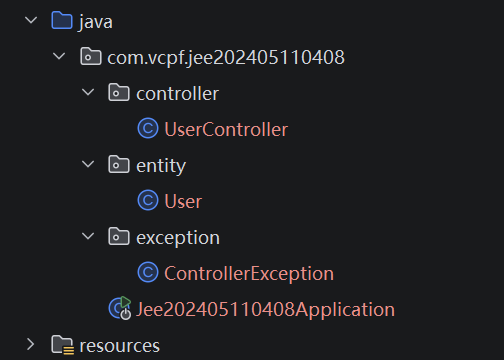
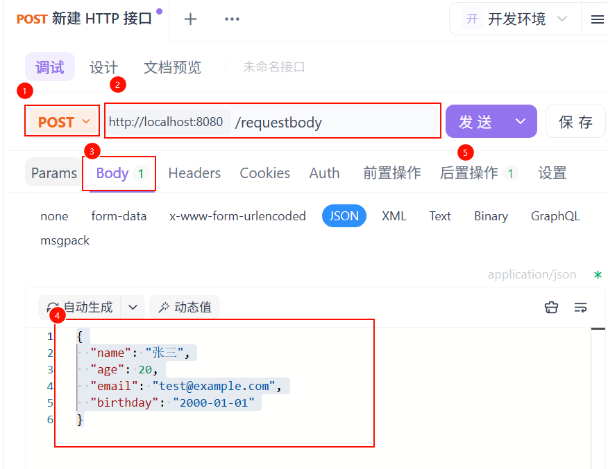

# 参数校验

在以往的项目中，也存在参数校验，但是这样的数据校验需要我们手动实现。在Spring的项目中，Spring为我们提供了相对应的参数检验注解。

# 项目依赖

``` xml
<dependency>
    <groupId>org.springframework.boot</groupId>
    <artifactId>spring-boot-starter-web</artifactId>
</dependency>

<dependency>
    <groupId>org.springframework.boot</groupId>
    <artifactId>spring-boot-starter-validation</artifactId>
</dependency>
<dependency>
    <groupId>org.springframework.boot</groupId>
    <artifactId>spring-boot-devtools</artifactId>
    <scope>runtime</scope>
    <optional>true</optional>
</dependency>
<dependency>
    <groupId>org.projectlombok</groupId>
    <artifactId>lombok</artifactId>
    <optional>true</optional>
</dependency>
<dependency>
    <groupId>org.springframework.boot</groupId>
    <artifactId>spring-boot-starter-test</artifactId>
    <scope>test</scope>
</dependency>
```

# 项目结构

需要添加实体(entity)、控制器(controller)、错误信息(exception);



## 实体(user)

- 字段类型：字符串，整型，日期类型

- 字段的校验：

  - 长度

  - 精度

  - 取值范围

  - 数据格式，如email的格式或是日期的取值区间等

添加了Lombok注解的用户实体：

```java
@Data
@AllArgsConstructor
@NoArgsConstructor
@Accessors(chain = true)
public class User {
    private String name;
    private Integer age;
    private String email;
    private LocalDate birthday;
}
```

添加devtools的validation注解，为实体添加字段验证，提供message提示信息：

```java
@Data
@AllArgsConstructor
@NoArgsConstructor
@Accessors(chain = true)
public class User {
    @NotBlank(message = "用户名不能为空")
    private String name;
    @Min(value = 1, message = "年龄不能小于1岁")
    @Max(value = 120, message = "年龄不能大于120岁")
    private Integer age;
    @Email(message = "邮箱格式不正确")
    private String email;
    @Past(message = "生日不能晚于当前时间")
    private LocalDate birthday;
}
```


## 控制器

```java
import javax.validation.Valid;

@RestController
public class UserController {

    /**
     * <pre>
     *     请求方式： 发起post请求
     *     地址： http://localhost:8080/requestbody
     *     正常响应： User的JSON
     *     异常响应： 也是JSON
     *          在errors键里面，可见出错提示
     *              objectName      - 对象名
     *              defaultMessage  - 提示信息
     *              rejectedValue   - 字段的值
     *              field           - 字段
     * </pre>
     * @param user
     * @return
     */
    @PostMapping("/requestbody")
    public User requestBody(@RequestBody @Valid User user) {
        return user;
    }
}
```


## 异常

```java
import java.util.HashMap;

@ControllerAdvice
public class ControllerException {

    private final View error;

    public ControllerException(View error) {
        this.error = error;
    }

    @ResponseBody
    @ExceptionHandler(MethodArgumentNotValidException.class)
    public Object handleValidException(MethodArgumentNotValidException e) {
        //将错误信息返回给前台
        String field;   // 字段
        String msg;    // 消息

        // 封装成errors的JSON对象
        HashMap<String, Object> errors = new HashMap<>();
        HashMap<String, String> errorMessage = new HashMap<>();
        for (FieldError fieldError : e.getBindingResult().getFieldErrors()) {
            // 获取错误验证字段名
            field = fieldError.getField();
            msg = fieldError.getDefaultMessage();
            // 调整格式
            errorMessage.put(field, msg);
        }
        errors.put("code", "600001");
        errors.put("msg", "数据校验出错");
        errors.put("errorsMessage", errorMessage);
        return errors;
    }
}
```


# 测试

## 测试样例

测试样例采用json格式，向8080端口发送post请求。

```json
{
  "name": "张三",
  "age": 20,
  "email": "test@example.com",
  "birthday": "2000-01-01"
}
```

使用apifox向程序发送json数据：


## 测试结果

打开apifox，按照步骤，选择post，修改http网址，发送body，添加json数据。



发送一个正确的信息，多组不同错误信息：

正确的日志：

```shell
2026-04-01 21:00:20.587  INFO 8392 --- [nio-8080-exec-1] o.s.web.servlet.DispatcherServlet        : Completed initialization in 0 ms
```

返回：

```json
{
    "name": "张三",
    "age": 20,
    "email": "test@example.com",
    "birthday": "2000-01-01"
}
```


姓名为空：

```shell
2026-04-01 21:01:51.751  WARN 8392 --- [nio-8080-exec-4] .m.m.a.ExceptionHandlerExceptionResolver : Resolved [org.springframework.web.bind.MethodArgumentNotValidException: Validation failed for argument [0] in public com.vcpf.jee202405110408.entity.User com.vcpf.jee202405110408.controller.UserController.requestBody(com.vcpf.jee202405110408.entity.User): [Field error in object 'user' on field 'name': rejected value []; codes [NotBlank.user.name,NotBlank.name,NotBlank.java.lang.String,NotBlank]; arguments [org.springframework.context.support.DefaultMessageSourceResolvable: codes [user.name,name]; arguments []; default message [name]]; default message [用户名不能为空]] ]
```

返回：

```json
{
    "msg": "数据校验出错",
    "code": "600001",
    "errorsMessage": {
        "name": "用户名不能为空"
    }
}
```

> 可以看到Spring对前端发送过来的请求进行了验证，并给出的对应的错误信息： "name": "用户名不能为空"