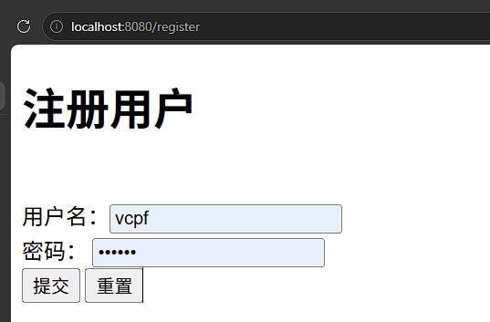
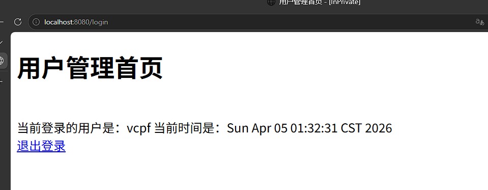

# 实验描述

本部分是对于实现注册登录网页的模拟，

## 项目架构

选用JDK8，Springboot：2.5.0实现

* entity ：实体
* service ： 服务层
* controller ：控制器
* webapp ：存放前端网页

## 程序依赖

```xml
<dependency>
    <groupId>org.springframework.boot</groupId>
    <artifactId>spring-boot-starter</artifactId>
</dependency>

<dependency>
    <groupId>org.springframework.boot</groupId>
    <artifactId>spring-boot-starter-test</artifactId>
    <scope>test</scope>
</dependency>
<dependency>
    <groupId>org.apache.tomcat.embed</groupId>
    <artifactId>tomcat-embed-jasper</artifactId>
</dependency>
<dependency>
    <groupId>jstl</groupId>
    <artifactId>jstl</artifactId>
    <version>1.2</version>
</dependency>
<dependency>
    <groupId>org.springframework.boot</groupId>
    <artifactId>spring-boot-devtools</artifactId>
    <scope>runtime</scope>
    <optional>true</optional>
</dependency>
<dependency>
    <groupId>org.projectlombok</groupId>
    <artifactId>lombok</artifactId>
    <version>1.18.20</version>
</dependency>
<dependency>
    <groupId>org.springframework.boot</groupId>
    <artifactId>spring-boot-starter-web</artifactId>
    <version>RELEASE</version>
    <scope>compile</scope>
</dependency>
```

```properties
# 配置jsp视图
spring.mvc.view.suffix=.jsp
spring.mvc.view.prefix=/WEB-INF/jsp/
```

# 项目实现

## 控制器

```java
@Controller
public class TestController {

    // 直接返回字符串的处理器
    // http://localhost:8080/test01
    @RequestMapping("/test01")
    @ResponseBody
    public String test() {
        return "test01 测试控制器";
    }

    // 返回视图，到达JSP页面
    // http://localhost:8080/test02
    @RequestMapping("/test02")
    public String index() {
        return "index";
    }
}
```

## 实体层

``` java
public class User {
    private String name;
    private String password;
}
```

## 服务层

``` java
package com.vcpf.jee202405110409.service;


import com.vcpf.jee202405110409.entity.User;
import org.springframework.stereotype.Service;

import java.util.ArrayList;
import java.util.List;
import java.util.Objects;

@Service
public class UserService {

    // 模拟内存数据：用户表，用户集合数据
    private List<User> users;

    // 只初始化一个用户
    public UserService() {
        users = new ArrayList<User>();
        User user = new User();
        user.setName("fhzheng");
        user.setPassword("123456");
        users.add(user);
    }

    // 完成CRUD业务
    // 添加
    public boolean addUser(User user) {
        try {
            users.add(user);
            return true;
        } catch (Exception e) {
            throw new RuntimeException(e);
        }
    }

    // 更新
    public boolean updateUser(User user) {
        try {
            // 找得到才能更新
            for (int i = 0; i < users.size(); i++) {
                if (users.get(i).getName() == user.getName()) {
                    users.set(i,user);
                    return true;
                }
            }
            return false;
        } catch (Exception e) {
            throw new RuntimeException(e);
        }
    }

    // 删除
    public boolean deleteUser(User user) {
        try {
            // 找得到才能删除
            for (int i = 0; i < users.size(); i++) {
                if (users.get(i).getName() == user.getName()) {
                    users.remove(i);
                    return true;
                }
            }
            return false;
        } catch (Exception e) {
            throw new RuntimeException(e);
        }
    }

    // 列表
    public List<User> getUsers() {
        return users;
    }

    // 按Id取出一个
    public User getUser(int id) {
        return users.get(id);
    }

    // 按名取首个匹配的用户，一个
    public User getUser(User user) {
        for (User user1 : users) {
            if (Objects.equals(user1.getName(), user.getName())) {
                return user1;
            }
        }
        return null;
    }
}

```


## 网页

index.jsp:

```jsp
<%@ page import="java.util.Date" %>
<%@page contentType="text/html; UTF-8" pageEncoding="UTF-8" %>
<!DOCTYPE html>
<html lang="en">
<head>
    <meta charset="UTF-8">
    <title>这是一张jsp动态页面，页面在WEB-INF/jsp目录下</title>
</head>
<body>
<h1>这是一张在WEB-INF/jsp目录下的jsp动态页面: index.jsp</h1> <br>
当前时间是：<%=new Date()%>

</body>
</html>
```

login.jsp:

``` jsp
<%@page contentType="text/html; UTF-8" pageEncoding="UTF-8" %>
<!DOCTYPE html>
<html lang="en">
<head>
    <meta charset="UTF-8">
    <title>用户登录</title>
    <style>
        span {
            color: red;
        }
    </style>
</head>
<body>
<h1>用户登录</h1> <br>
<form action="login" method="post">
    用户名：<input type="text" name="name" /> <br>
    密码： <input type="password" name="password"/> <br>
    <input type="submit" value="登录" />
    <input type="reset" value="重置">
    <span>${msg}</span>
</form>

</body>
</html>
```

rigister.jsp

```jsp
<%@page contentType="text/html; UTF-8" pageEncoding="UTF-8" %>
<!DOCTYPE html>
<html lang="en">
<head>
    <meta charset="UTF-8">
    <title>注册用户</title>
</head>
<body>
<h1>注册用户</h1> <br>
<form action="regist" method="get">
    用户名：<input type="text" name="name" /> <br>
    密码： <input type="password" name="password"/> <br>
    <input type="submit" value="提交" />
    <input type="reset" value="重置">
</form>

</body>
</html>
```


# 问题：

1. 在初期的服务层时，仅使用`.equals()`函数做比对，但是反馈结果是网页错误。经排查，应当使用Object的`.equals()`方法进行比较，即：`Objects.equals(user1.getName(), user.getName())`
2. 没有做持久化，每一次测试都需要重复注册操作，之后才可以进行登录验证


# 实现记录




